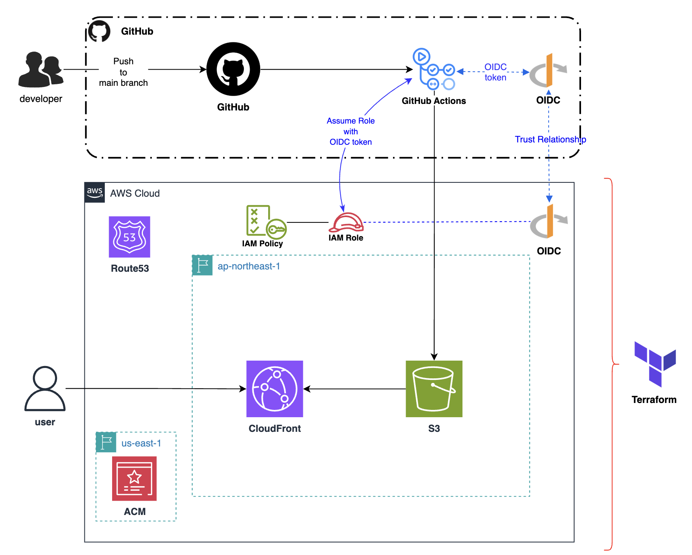

# 👽 My Portfolio Site
*Check it out* 👉 [**fuuji.site**](https://fuuji.site/)

# 🌱 Tech Stack
| Frontend | Backend | Infra |
|----------|---------|----------------|
|     |  |    |

# 🛠️ Architecture

## 📂 IaC Repository

The Terraform configuration used to provision the infrastructure (`S3`, `CloudFront`, `Route53`, `ACM`, `IAM`, etc.) is available in a separate repository 👍

👉 [**terraform_s3_cloudfront**](https://github.com/anton-fuji/terraform_s3_cloudfront)
